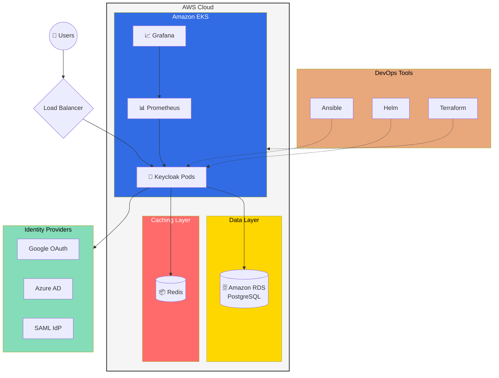

# 🔐 Keycloak DevOps Implementation

[](https://opensource.org/licenses/MIT)
[](https://kubernetes.io/)
[](https://www.terraform.io/)
[](https://www.ansible.com/)

Production-grade Keycloak implementation with complete DevOps practices, Infrastructure as Code (IaC), and automated configuration management.

## 🎯 Features

- 🏗️ **Infrastructure as Code** with Terraform
- 🚀 **Automated Deployment** via GitOps workflow
- 🔄 **High Availability** setup with load balancing
- 📊 **Monitoring & Alerting** with Prometheus/Grafana
- 🔒 **Security Hardening** with best practices
- 🔍 **Audit Logging** and compliance features
- 🔄 **Multiple Authentication Flows** support

## 🏛️ Architecture



## 🚀 Quick Start

### Prerequisites

- AWS Account with administrative access
- Terraform ≥ 1.0.0
- kubectl ≥ 1.21
- Helm ≥ 3.0.0
- Ansible ≥ 2.9

### Installation Steps

1. **Clone the Repository**
   ```bash
   git clone https://github.com/yourusername/keycloak-devops-implementation
   cd keycloak-devops-implementation
   ```

2. **Infrastructure Setup**
   ```bash
   cd terraform
   terraform init
   terraform apply
   ```

3. **Deploy Keycloak**
   ```bash
   cd ../helm
   helm install keycloak ./keycloak-chart
   ```

## 📚 Documentation

- [Detailed Setup Guide](docs/SETUP.md)
- [Configuration Guide](docs/CONFIGURATION.md)
- [Monitoring Guide](docs/MONITORING.md)
- [Backup & Recovery](docs/BACKUP.md)
- [Security Best Practices](docs/SECURITY.md)

## 🔍 Use Cases

- Single Sign-On (SSO) implementation
- Multi-factor Authentication (MFA)
- Social Login Integration
- Enterprise Identity Federation
- API Security with OAuth2/OIDC

## 🛠️ Maintenance

- Regular security updates
- Backup and recovery procedures
- Performance monitoring
- Scaling guidelines

## 🤝 Contributing

Contributions are welcome! Please read our [Contributing Guidelines](CONTRIBUTING.md) first.

## 📄 License

This project is licensed under the MIT License - see the [LICENSE](LICENSE) file for details.

## 📞 Support

For issues and feature requests, please use the [GitHub Issues](https://github.com/yourusername/keycloak-devops-implementation/issues) page.
